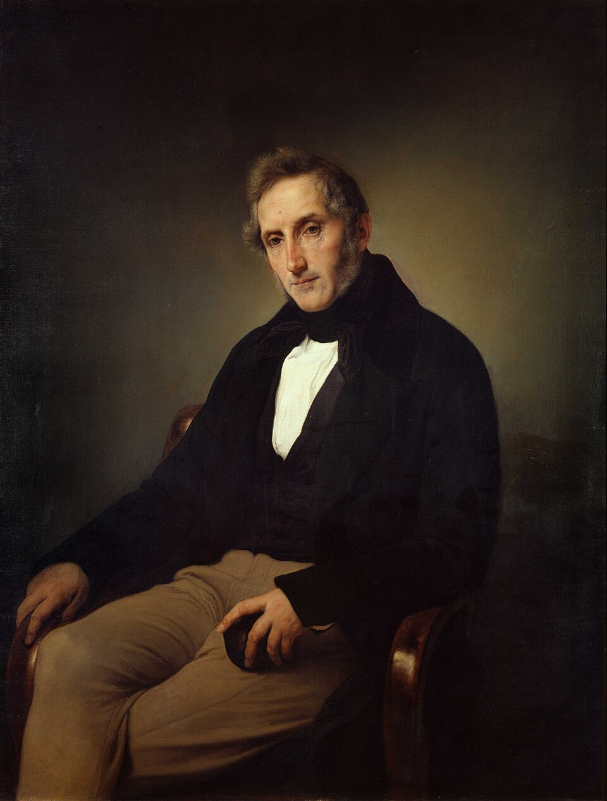
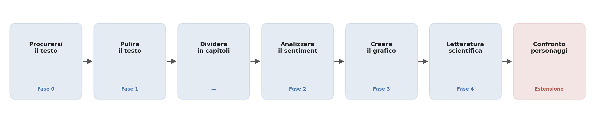
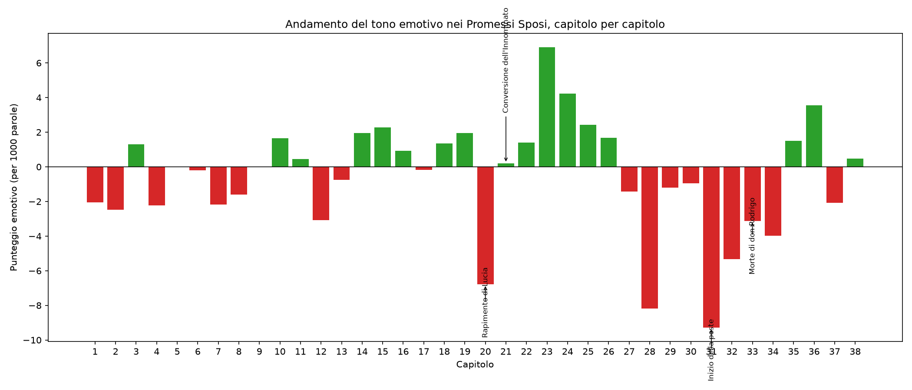
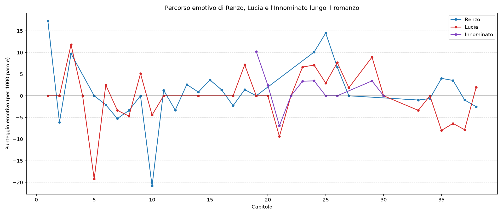

# Il tono della peste: mappare le emozioni nei Promessi Sposi

## Domanda di ricerca

L'andamento del tono emotivo nei capitoli dei Promessi Sposi rispecchia i momenti
narrativamente più drammatici del romanzo (in particolare la peste e la morte di
don Rodrigo)? Un metodo automatico di sentiment analysis, per quanto semplice, è
in grado di "riconoscere" questi momenti chiave tanto quanto un lettore umano che
conosce la trama?

## Ipotesi

I capitoli corrispondenti agli eventi narrativamente più drammatici (in
particolare i capitoli della peste, XXXI-XXXIV) mostrano un punteggio emotivo
nettamente più negativo rispetto ai capitoli circostanti, e il punteggio torna
positivo verso la fine del romanzo, in corrispondenza della risoluzione della
trama.

## Metodo

### 1. Raccolta dei dati
Il testo completo dei Promessi Sposi (edizione Liber Liber, a cura di Angelo
Marchese) è stato scaricato da un mirror universitario in formato PDF e
convertito in testo semplice con la libreria Python `pypdf`. È stata scelta
questa fonte (invece di Project Gutenberg, la fonte originariamente prevista)
perché quest'ultima risultava irraggiungibile dalla rete usata per il progetto:
una scelta pragmatica, documentata qui per trasparenza, che non altera il
contenuto del testo (la stessa edizione Liber Liber è disponibile da entrambe
le fonti).

### 2. Pulizia dei dati
Dal testo grezzo sono stati rimossi: il materiale editoriale iniziale di Liber
Liber (informazioni sull'edizione, licenza, ecc., non facenti parte del
romanzo), e le righe composte da un solo numero, residuo dei numeri di pagina
del PDF originale rimasti "incastrati" nel testo durante l'estrazione.

### 3. Segmentazione in capitoli
Il testo pulito è stato diviso nei suoi 38 capitoli individuando con
un'espressione regolare le intestazioni nella forma "CAPITOLO" seguita da un
numero romano. Il numero di capitoli trovati (38) corrisponde esattamente al
numero reale di capitoli del romanzo, a conferma della correttezza della
segmentazione.

### 4. Analisi del sentiment
Per ciascun capitolo è stato calcolato un punteggio di sentiment tramite un
metodo a dizionario (lexicon-based): un elenco di circa 75 parole italiane
positive e altrettante negative, scelto a mano pensando al lessico tipico della
narrativa ottocentesca (parole come "paura", "morte", "speranza", "pace",
"peste", "gioia"). Il testo di ogni capitolo è stato suddiviso in parole
(tokenizzazione), e per ciascuna parola è stato verificato se comparisse
nell'uno o nell'altro elenco. Il punteggio finale è dato dalla differenza tra
parole positive e negative trovate, **normalizzata ogni 1000 parole** per
rendere confrontabili capitoli di lunghezza molto diversa (il capitolo più
lungo e quello più corto del romanzo differiscono di oltre il triplo in numero
di parole: senza normalizzazione, i capitoli più lunghi risulterebbero
artificialmente più "carichi" emotivamente solo perché contengono più parole in
assoluto).

### 5. Visualizzazione
I punteggi dei 38 capitoli sono stati rappresentati in un grafico a barre
(capitolo sull'asse orizzontale, punteggio sull'asse verticale), con alcuni
capitoli chiave della trama esplicitamente etichettati per il confronto visivo
diretto tra risultato automatico e conoscenza della trama.

## Risultati

I capitoli XXXI-XXXIV (la sezione della peste) mostrano i punteggi più negativi
di tutto il romanzo: -9.28, -5.34, -3.12 e -3.99 rispettivamente. Il capitolo
XXXI (-9.28) è in assoluto il più negativo dell'intero libro. Dal capitolo XXXV
in poi il punteggio torna positivo (+1.50, +3.56), coerentemente con l'avvio
della risoluzione narrativa (fine della peste, avvicinamento al lieto fine).

Questo risultato **conferma l'ipotesi**: un metodo di analisi automatica anche
molto semplice, basato solo sul conteggio di parole rispetto a un dizionario
fisso, è stato in grado di individuare correttamente uno dei momenti più cupi
del romanzo, senza alcuna conoscenza della trama incorporata nello script.

Il punteggio più alto di tutto il romanzo si trova invece al capitolo XXIII
(+6.8), dentro una fascia stabilmente positiva che comprende i capitoli
XXII-XXVI. Questa fascia corrisponde alla parte del romanzo successiva alla
liberazione di Lucia dall'Innominato (capitolo XXIII), quando Lucia viene
accolta da donna Prassede e incontra il cardinale Federigo Borromeo: un
tratto di narrazione più disteso, prima della svolta drammatica della peste.
Questo picco non era stato individuato in anticipo tra i capitoli chiave
scelti prima dell'analisi (rapimento, conversione, peste, morte di don
Rodrigo): è quindi un risultato osservato a posteriori, e va per questo
trattato con un po' più di cautela interpretativa rispetto agli altri, che
erano invece attesi fin dall'inizio.

## Confronto con la letteratura

Il metodo utilizzato si inserisce in un filone di ricerca consolidato, quello
della "computational literary analysis" applicata all'andamento emotivo delle
narrazioni. Reagan et al. (2016), in uno studio molto citato, hanno applicato
strumenti di sentiment analysis lessicale a migliaia di opere letterarie,
mostrando che la maggior parte delle storie segue un numero limitato di "forme"
emotive ricorrenti lungo il loro sviluppo — esattamente il tipo di andamento
che questo progetto ha cercato di ricostruire, su scala più piccola e per un
singolo romanzo italiano.

Un aspetto metodologico rilevante emerso dalla stessa letteratura è che i
metodi a dizionario tendono a funzionare peggio della casualità se applicati a
singole frasi isolate, un problema che si attenua lavorando su porzioni di
testo più ampie. Questo giustifica la scelta di lavorare a livello di intero
capitolo (migliaia di parole) anziché di singola frase: una scelta
metodologica consapevole, non solo una semplificazione pratica.

Rebora (2020) ha condotto un esperimento con studenti universitari per
verificare l'efficacia della sentiment analysis su un testo letterario
italiano (un racconto di Pirandello), chiedendo loro di annotare manualmente
il sentiment di ogni paragrafo. Il lavoro conferma sia l'utilità sia i limiti
di questi strumenti quando applicati a testi letterari in lingua italiana,
un contesto linguisticamente più complesso rispetto ai testi per cui questi
metodi sono stati originariamente sviluppati (recensioni, social media).

## Limiti del metodo

È importante essere espliciti sui limiti di questo approccio, per due motivi:
mostra consapevolezza critica (richiesta esplicitamente dalla consegna del
progetto) e anticipa possibili domande in sede d'esame.

- **Dizionario limitato**: l'elenco di parole positive/negative usato
  (circa 150 parole totali) è una scelta manuale e non esaustiva. Molte
  espressioni emotive del romanzo (soprattutto quelle indirette o
  metaforiche) non vengono catturate.
- **Nessuna gestione della negazione**: la frase "non provava alcuna gioia"
  viene comunque conteggiata come positiva per la presenza della parola
  "gioia", anche se il significato reale è negativo. Questo è un limite
  noto di tutti i metodi a dizionario semplice.
- **Nessuna comprensione del contesto o dell'ironia**: il metodo conta
  parole isolate, senza capire il senso della frase in cui compaiono.
- **Lessico ottocentesco vs. dizionario moderno**: il dizionario è stato
  costruito pensando all'italiano contemporaneo; alcune espressioni
  tipiche della prosa manzoniana potrebbero non essere ben rappresentate.
- **Un solo metodo**: non essendoci stato un confronto con un secondo
  metodo indipendente (ad esempio l'analisi tramite un LLM via API), non
  possiamo escludere che parte del risultato osservato dipenda da
  caratteristiche specifiche di questo dizionario piuttosto che da un
  segnale emotivo reale e robusto.

## Estensione — Confronto tra il percorso emotivo di tre personaggi

Come approfondimento facoltativo, l'analisi è stata estesa dal livello
dell'intero capitolo al livello del singolo personaggio, per verificare se
Renzo, Lucia e l'Innominato mostrano andamenti emotivi diversi lungo il
romanzo.

### Metodo

Per ciascun capitolo, il testo è stato diviso in singole frasi. Sono state poi
isolate, per ciascun personaggio, solo le frasi in cui compare il suo nome o
una variante (Renzo: "Renzo", "Tramaglino"; Lucia: "Lucia", "Mondella";
Innominato: "Innominato"). Sul testo così isolato è stato calcolato lo stesso
punteggio di sentiment usato nella Fase 2 (stesso dizionario di parole
positive/negative, stessa normalizzazione ogni 1000 parole), per restare
pienamente confrontabile con l'analisi generale del romanzo. I capitoli in cui
un personaggio non compare affatto sono stati esclusi dal grafico per quel
personaggio (l'Innominato, per esempio, entra in scena solo a metà libro).

### Risultati

Il grafico ottenuto (`grafico_personaggi.png`) mostra tre linee, una per
personaggio, lungo i 38 capitoli. Il pattern più rilevante emerge attorno ai
**capitoli 19-21**: l'Innominato tocca il suo punto più alto al capitolo XIX
(+10.2), per poi crollare insieme a Lucia al capitolo XXI (Innominato -6.9,
Lucia -9.4) — esattamente il momento della trama in cui avviene la notte di
crisi e tormento dell'Innominato, innescata dal rapimento di Lucia da lui
ordinato al capitolo XX. Dal capitolo XXII in poi l'Innominato risale a valori
stabilmente positivi, coerentemente con la sua conversione.

### Verifica di affidabilità statistica

Prima di considerare questi risultati robusti, è stato controllato quante
frasi sostengono ciascuna osservazione, perché un punteggio calcolato su
pochissime frasi può oscillare fortemente per la presenza o assenza di una
sola parola del dizionario:

| Osservazione | Frasi | Parole | Affidabilità |
|---|---|---|---|
| Lucia, cap. V (punto basso) | 4 | 52 | Bassa |
| Renzo, cap. X (punto basso) | 1 | 48 | Bassissima |
| Renzo, cap. XXV (punto alto) | 2 | 69 | Bassa |
| Innominato, cap. XIX (punto alto) | 2 | 98 | Bassa |
| Innominato, cap. XXI (crollo) | 11 | 289 | Discreta |
| Lucia, cap. XXI (crollo) | 20 | 532 | Buona |

Questa verifica mostra un punto metodologico importante: i picchi isolati nei
primi capitoli del romanzo (dove i personaggi compaiono ancora poco, in poche
frasi per capitolo) sono statisticamente poco solidi e vanno citati con
cautela — bastano una o due parole del dizionario a spostare il punteggio in
modo consistente. Il pattern del capitolo XXI, invece, essendo basato su un
numero di frasi molto più alto (11 e 20), è l'osservazione più solida
dell'intera estensione, ed è anche quella narrativamente più significativa.

### Cosa aggiunge questa estensione al progetto

Oltre al risultato in sé, l'estensione mostra che lo stesso metodo usato nella
Fase 2 può essere riapplicato a un livello di granularità diverso (il
personaggio invece del capitolo intero) senza modificare il dizionario o la
logica di calcolo, e che la verifica critica dell'affidabilità statistica dei
singoli punti del grafico è un passaggio necessario prima di trarre
conclusioni da un metodo che, per sua natura, è sensibile alla quantità di
testo disponibile.

## Conclusioni

Nonostante i limiti descritti, il progetto mostra che anche un metodo di
sentiment analysis molto semplice ed economico da implementare è in grado di
individuare correttamente, senza alcuna conoscenza pregressa della trama, uno
dei momenti narrativamente ed emotivamente più rilevanti dei Promessi Sposi (la
peste). Questo risultato supporta l'ipotesi di partenza e si allinea con
quanto osservato in letteratura su altre opere letterarie.

L'estensione sul confronto tra personaggi rafforza ulteriormente questa
conclusione: applicato a un livello di analisi più fine (il singolo
personaggio anziché il capitolo intero), lo stesso metodo individua un
secondo momento chiave della trama — la crisi dell'Innominato e di Lucia al
capitolo XXI — e lo fa in modo tanto più credibile quanto più ampio è il
campione di testo disponibile, un aspetto verificato esplicitamente e non
solo assunto.

Il metodo, proprio per la sua semplicità e trasparenza, si presta bene a
un'analisi didattica come questa, dove l'obiettivo non è la massima
accuratezza possibile ma la comprensione critica di cosa un metodo
computazionale può e non può cogliere di un testo letterario — e di quanto
ci si possa fidare di ciascun singolo risultato che produce.

In sintesi, la risposta alla domanda di ricerca è positiva, con le cautele
discusse nella sezione dei limiti: l'andamento del tono emotivo nei capitoli
dei Promessi Sposi rispecchia effettivamente i momenti narrativamente più
drammatici del romanzo, e un metodo automatico anche semplice è in grado di
individuarli senza alcuna conoscenza pregressa della trama.
